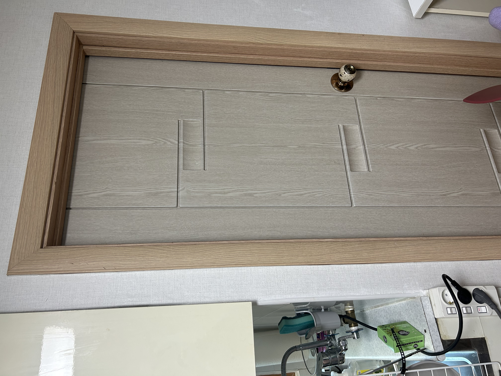
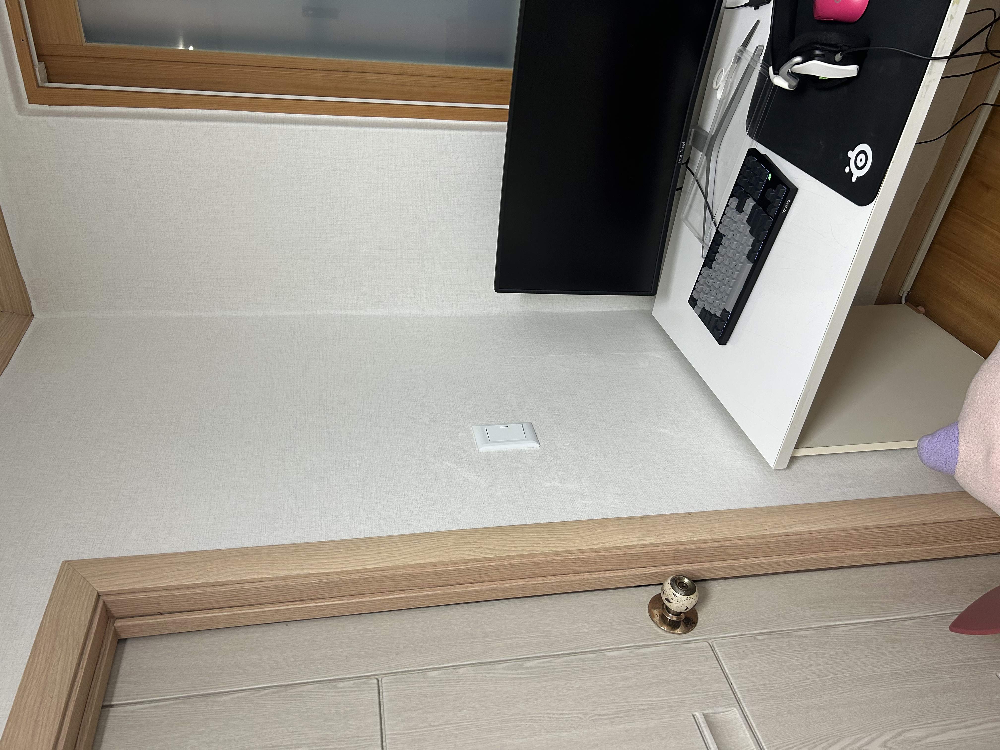
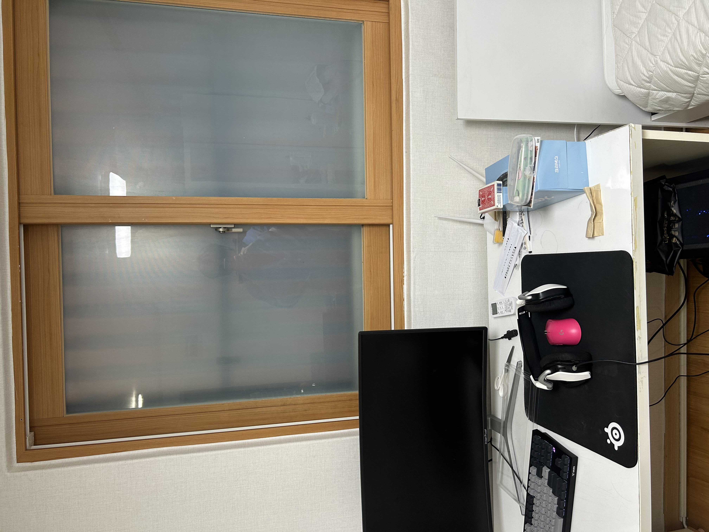
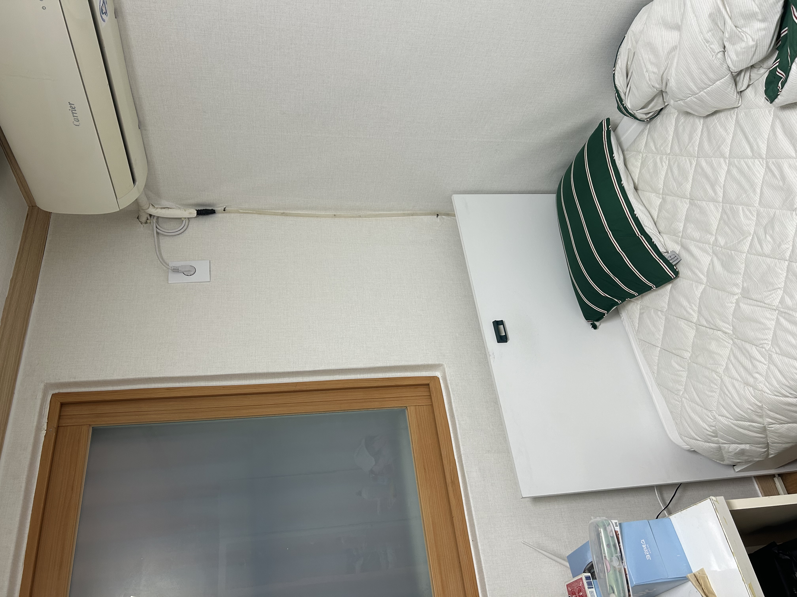

# Divide-Conquer-Stitcher
Automated Image Stitching system using Divide and Conquer algorithm and Cosine-based Alpha Blending with OpenCV.

### Divide and Conquer 알고리즘
그냥 순서대로 이어도 되지만 한번 분할정복으로 가능한지 궁금해서 사용. 이미지가 많아지면 순차적으로 하는 것보다 속도적으로 빠를 것으로 예상

### Cosine-weighted Alpha Blending
이미지 간의 접합면을 자연스럽게 처리하기 위한 기능

### Robust Image Processing Pipeline
- **SIFT & FLANN**: Scale-Invariant Feature Transform을 통해 특징점을 추출하고, FLANN Matcher로 정밀한 매칭을 수행
- **RANSAC Homography**: 5.0 임계값의 RANSAC 알고리즘을 적용하여 이상치(Outliers)를 배제하고 정확한 투영 행렬을 계산

---

### Original Images(Inputs)
| 원본 이미지 1 | 원본 이미지 2 | 원본 이미지 3 | 원본 이미지 4 |
| :---: | :---: | :---: | :---: |
|  |  |  |  |

### Final Panorama(Output)

